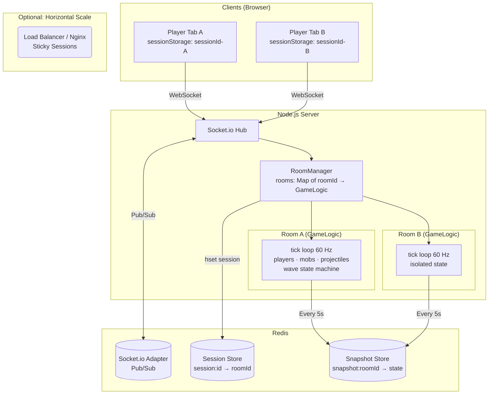
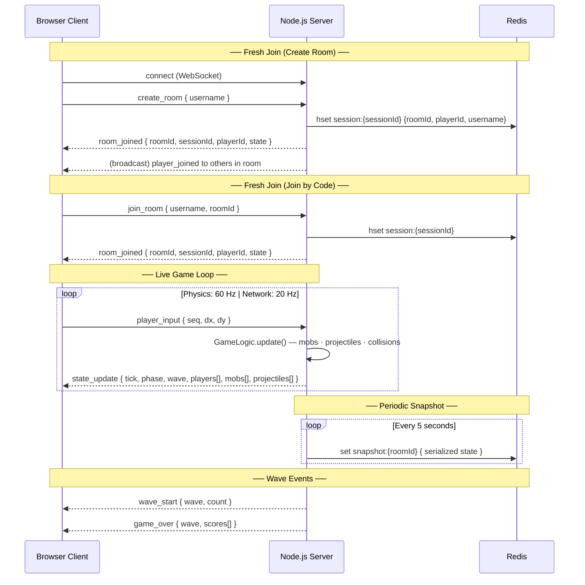
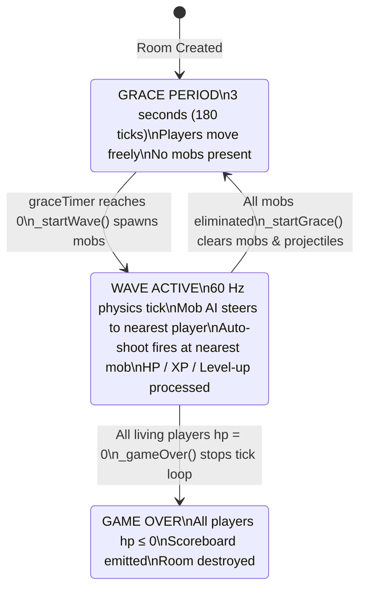
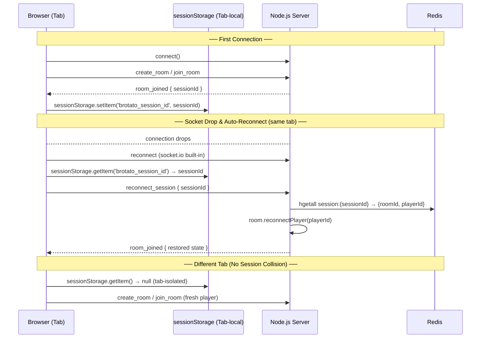
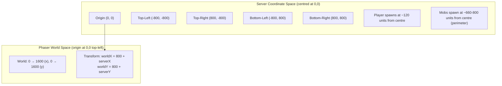

# Architecture & Communication Flow

## 1. System Architecture Overview

---

## 2. Client–Server Message Flow

---

## 3. Wave State Machine

---

## 4. Session & Reconnection Flow

---

## 5. Room Isolation Model

```mermaid
graph LR
    subgraph "Room A (UUID: aec590b2...)"
        PA[Player: Alice]
        PB[Player: Bob]
        MA[Mobs: Wave 3]
        PA -.->|interact| MA
        PB -.->|interact| MA
    end

    subgraph "Room B (UUID: 7f3d1a22...)"
        PC[Player: Carol]
        MB[Mobs: Wave 1]
        PC -.->|interact| MB
    end

    RA[Socket.io Room A] -->|io.to&#40;roomIdA&#41;| PA
    RA --> PB
    RB[Socket.io Room B] -->|io.to&#40;roomIdB&#41;| PC

    note1["Room A and Room B share\nzero game state.\nEach has its own:\n• GameLogic instance\n• setInterval tick loop\n• players/mobs/projectiles Maps"]
```

---

## 6. Entity Coordinate System

